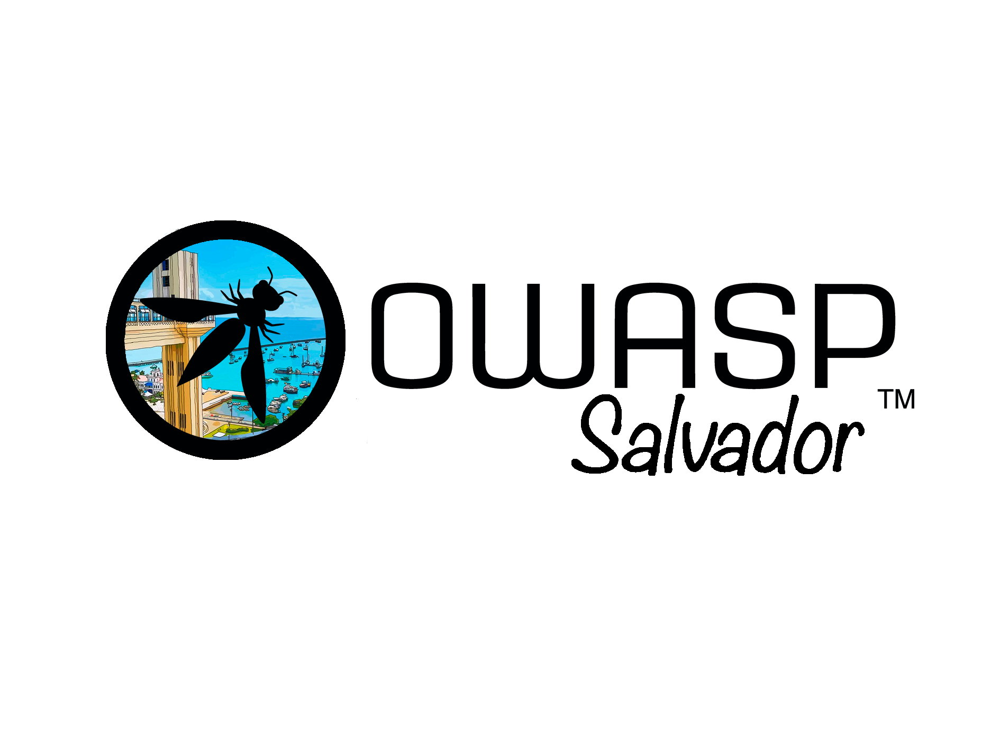

# OWASP Salvador Chapter

Bem-vindo ao repositório oficial do capítulo OWASP de Salvador!

## Sobre

O capítulo OWASP de Salvadore é uma comunidade local dedicada a melhorar a segurança do software na região. Fazemos parte da [OWASP (Open Worldwide Application Security Project)](https://owasp.org/), uma fundação sem fins lucrativos que trabalha para melhorar a segurança do software.

## Missão

Nossa missão é tornar a segurança das aplicações visível, para que pessoas e organizações possam tomar decisões informadas sobre os verdadeiros riscos de segurança das aplicações.

## Como Contribuir

Estamos sempre abertos a contribuições da comunidade. Aqui estão algumas maneiras de se envolver:

1. **Participe dos Eventos**: Acompanhe nossa [página no Meetup](https://www.meetup.com/owasp-salvador-chapter/) para informações sobre próximos eventos.
2. **Proponha uma Palestra**: Tem conhecimento para compartilhar? Entre em contato conosco!
3. **Contribua com Código**: Faça um fork deste repositório, faça suas alterações e envie um pull request.
4. **Reporte Problemas**: Encontrou um bug ou tem uma sugestão? Abra uma issue!

## Liderança

Nossa equipe de liderança atual inclui:

* [Leonardo Rosário](mailto:leonardo.rosario@owasp.org)
* [Eugênio Nunes](mailto:eugenio.nunes@owasp.org)
* [Daniel Guedes](mailto:daniel.guedes@owasp.org)
* [Manoelito Filho](mailto:manoelito.filho@owasp.org)

## Contato

- **Email**: [owasp-salvador-chapter@googlegroups.com](mailto:owasp-salvador-chapter@googlegroups.com)
- **Meetup**: [OWASP Salvador Chapter](https://www.meetup.com/owasp-belo-horizonte-chapter/)

## Licença

Este projeto está licenciado sob a Licença MIT - veja o arquivo [LICENSE.md](LICENSE.md) para detalhes.

---
