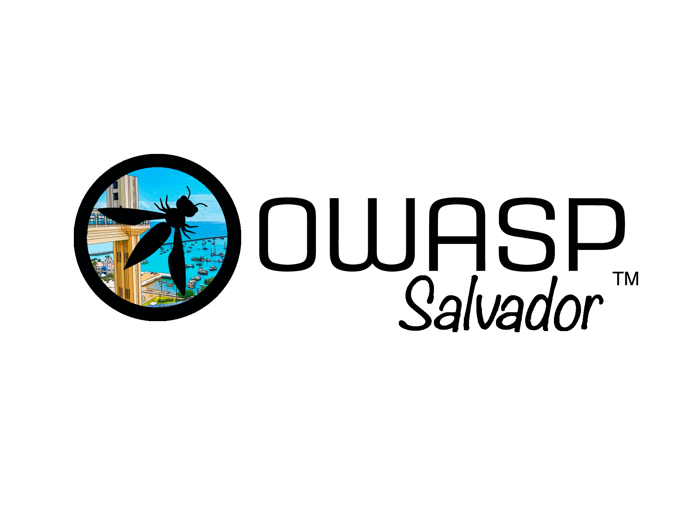

---

layout: col-sidebar
title: OWASP Salvador
tags: example-tag
region: South America
country: Brazil
meetup-group: salvador-open-source-intelligence-meetup-group

---

 

## Bem-vindo ao OWASP Chapter Salvador
Salvador, capital do estado da Bahia, é uma das cidades mais vibrantes do Brasil, conhecida por sua rica herança cultural, histórica e arquitetônica. Berço do sincretismo religioso, da música e da culinária afro-brasileira, Salvador é referência em diversidade e inovação. A cidade abriga uma crescente comunidade de tecnologia e segurança cibernética, que se fortalece através de iniciativas como o OWASP Chapter Salvador, promovendo a educação e colaboração na área de segurança de aplicações.

O OWASP Chapter Salvador é uma iniciativa local da Open Worldwide Application Security Project (OWASP), dedicada a promover a segurança de software na comunidade de Salvador e região. Nosso objetivo é disseminar conhecimentos, boas práticas e ferramentas relacionadas à segurança de aplicações, criando um ambiente colaborativo para profissionais, estudantes e entusiastas da área.

### O que fazemos?

- **Eventos e Workshops**: Organizamos encontros regulares com palestras, workshops e debates sobre segurança de software.
- **Networking**: Promovemos a interação entre profissionais de segurança, desenvolvedores e empresas locais.
- **Educação**: Compartilhamos recursos educacionais gratuitos para capacitar a comunidade em segurança de aplicações.

### Como participar?

Todos são bem-vindos a participar das nossas atividades, sejam elas presenciais ou online. Fique à vontade para se inscrever em nossos eventos no [Meetup do OWASP Salvador](https://www.meetup.com/OWASP-Salvador/). Além disso, encorajamos a colaboração através dos nossos [projetos](https://owasp.org/projects/) e grupos comunitários.

Para mais informações, entre em contato conosco ou participe de uma de nossas reuniões.

### Equipe OWASP Salvador
Atualmente, o OWASP Salvador é liderado por:
* [Leonardo Rosário](mailto:leonardo.rosario@owasp.org)
* [Eugênio Nunes](mailto:eugenio.nunes@owasp.org)
* [Daniel Guedes](mailto:daniel.guedes@owasp.org)
* [Manoelito Filho](mailto:manoelito.filho@owasp.org)
* [Wesley Sampaio](mailto:wesley.sampaio@owasp.org)

---------------------
Todos são bem vindos, quer colaborar?
 [Seja membro](/membership/) ou realize uma [doação](/donate/).

Próximos eventos <!-- You should keep this section as it will populate your meetup events -->
---------------------
